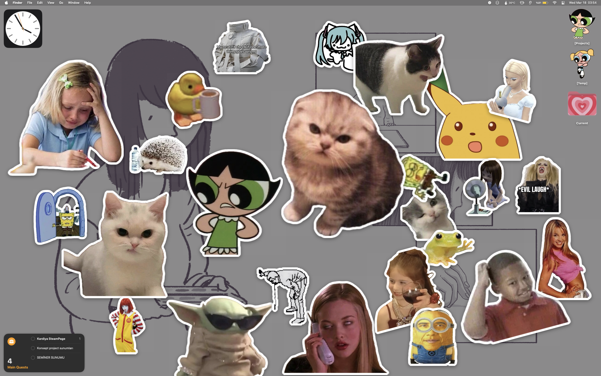
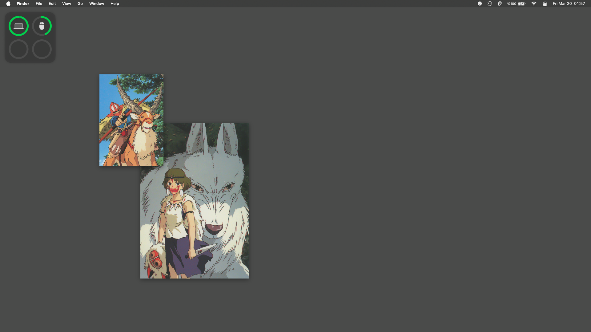

# Stickurr

Stickurr is a lightweight, native macOS application that allows you to place stickers (images) anywhere on your desktop. It's designed to be simple and cute.

> Check other screenshots too.

## Features

### Core functions
- You can use PNG files or images that you copied.
- Scale and rotate the stickers, toggle their outlines.
- It consumes almost no system resources.
- Stickers can be on top of other windows.
- It remembers where you put the stickers. 
- And only works on the menu bar for quick access.

### Stickerss
- **Move:** Long-press on a sticker to "pick it up" and drag it anywhere on your screen.
- **Context Menu:** Right-click any sticker to access quick actions:
  - **Grow/Shrink:** Resize your stickers (hold `Shift` for 5x faster scaling).
  - **Rotate:** Spin your stickers clockwise or counter-clockwise.
  - **Toggle Outline:** Show or hide a clean white border around your sticker.
  - **Reset:** Instantly restore a sticker to its original size and rotation.
  - **Remove:** Delete a single sticker from your desktop.

### Known baddies:
- External displays cause cluttered stickers when you unplug them.
- Sometimes rotation or scaling work after you hold the sticker. (idk why)

## Technical stuff
- Made with Swift and AppKit. 
- Very lightweight. (Like 0.01% of CPU usage)
- Only data that is stored:
  * '/Users/username/Library/Application Support/Stickurr' for Sticker PNGs
  * '/Users/uluckaymak/Library/Preferences/Stickurr.plist' for Sticker Attributes

--- 

## License
Created by Uluç Kaymak. All rights reserved.
