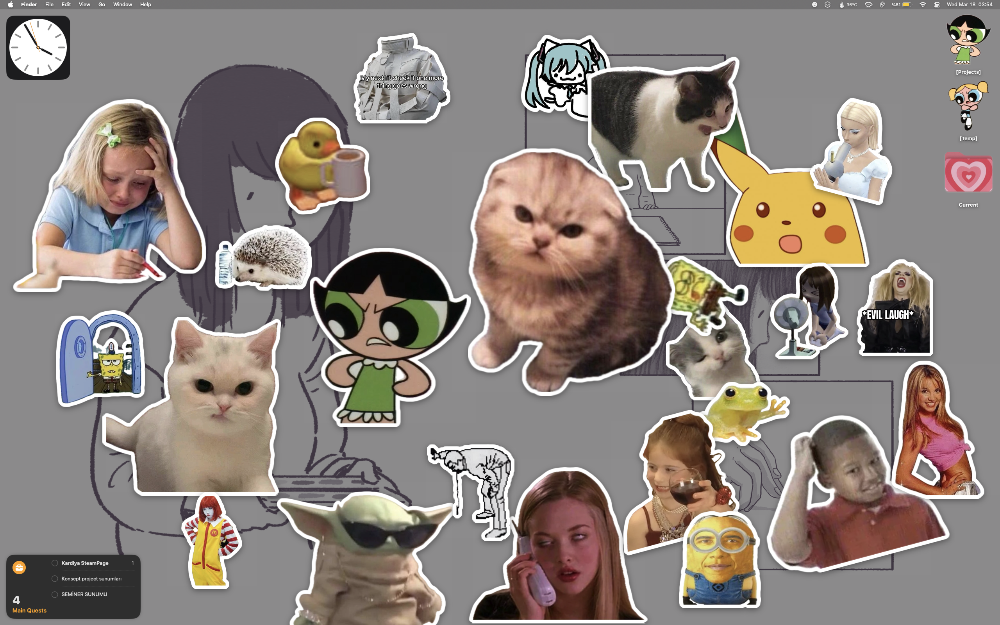
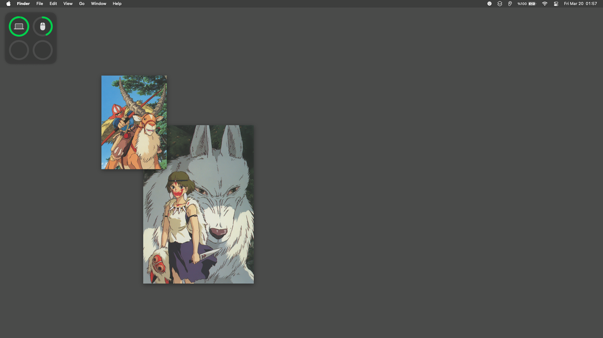

# Stickurr

Stickurr is a lightweight, native macOS application that allows you to place stickers (images) anywhere on your desktop. It's designed to be simple and cute.

> Check other screenshots too.

## Features

### Core functions
- You can use PNG and JPEG files or images that you copied.
- You can scale and rotate the stickers, toggle their outlines. (Idk what else I can do)
- Stickers can be on top of other windows.
- It consumes almost no system resources.
- It remembers where you put the stickers. 
- Works in your other monitors too.
- It stores your stickers so you don't lose them.
- And only works on the menu bar for clean look.

### Stickerss
- **Move:** Long-press on a sticker to "pick it up" and drag it anywhere on your screen.
- **Context Menu:** Right-click any sticker to access quick actions:
  - **Grow/Shrink:** Resize your stickers (hold `Shift` for 5x faster scaling).
  - **Rotate:** Spin your stickers clockwise or counter-clockwise.
  - **Toggle Outline:** Show or hide a clean white border around your sticker.
  - **Reset:** Instantly restore a sticker to its original size and rotation.
  - **Remove:** Delete a single sticker from your desktop.

### Known baddies
- Sometimes rotation or scaling work after you hold the sticker. (idk why)
- Me. [Btw, you can buy me a coffee.](http://buymeacoffee.com/uluckaymak)

## Technical stuff
- Made with Swift and AppKit/SwiftUI. 
- Very lightweight. (Like 0.01% of CPU usage)
- All data is stored in one place for easy backup:
  * `~/Library/Application Support/Stickurr/` for both Sticker PNGs and the `stickers.json` data file.

## License
Created by Uluç Kaymak. All rights reserved.
